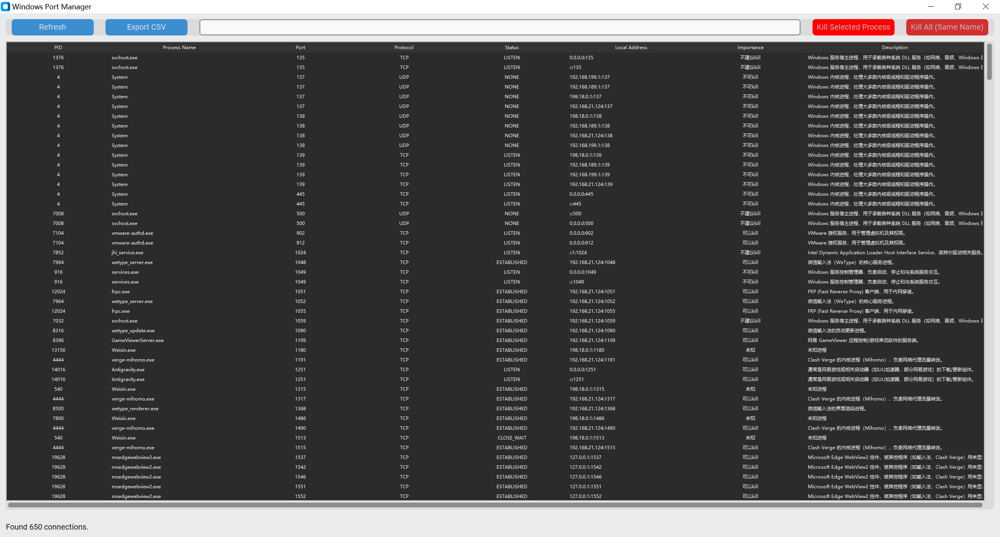

# Windows Port Manager | Windows 端口管理器

[English](#english) | [中文](#chinese)

<a name="english"></a>
## 🇬🇧 English

### Introduction
**Windows Port Manager** is a powerful and user-friendly desktop application designed to help users monitor and manage network ports and processes on Windows. Built with Python and CustomTkinter, it provides a modern interface to visualize network activity and safely manage system processes.

### Features
- **Real-time Monitoring**: View detailed information about active network connections, including PID, Process Name, Port, Protocol, Status, and Local Address.
- **Safety First**: Built-in protection mechanism to prevent accidental termination of critical system processes (marked as "Important").
- **Process Management**: 
  - Kill a specific selected process.
  - Kill all processes with the same name.
- **Search & Filter**: Real-time filtering by Process Name or Port number.
- **Data Export**: Export the current list of connections to a CSV file for further analysis.
- **Modern UI**: A clean, dark-themed interface powered by CustomTkinter.

### Screenshot



### Installation & Usage
1. **Requirements**:
   - Python 3.8+
   - Install dependencies:
     ```bash
     pip install -r requirements.txt
     ```
     *(Main dependencies: `customtkinter`, `psutil`)*

2. **Running the App**:
   ```bash
   python main.py
   ```
   *Note: The application will automatically request Administrator privileges to ensure it can access all network and process information.*

3. **Building Executable**:

   ```bash
   python build.py
   ```

---

<a name="chinese"></a>
## 🇨🇳 中文

### 简介
**Windows 端口管理器** 是一款功能强大且易于使用的桌面应用程序，专为 Windows 用户设计，用于监控和管理网络端口及进程。该应用基于 Python 和 CustomTkinter 构建，提供了现代化的用户界面，帮助用户直观地查看网络活动并安全地管理系统进程。

### 功能特性
- **实时监控**: 查看活动网络连接的详细信息，包括 PID、进程名称、端口、协议、状态和本地地址。
- **安全机制**: 内置保护机制，防止意外终止关键系统进程（标记为"不可kill"）。
- **进程管理**: 
  - 结束当前选中的特定进程。
  - 结束所有同名进程。
- **搜索与过滤**: 支持按进程名称或端口号进行实时过滤。
- **数据导出**: 将当前连接列表导出为 CSV 文件以便进一步分析。
- **现代界面**: 基于 CustomTkinter 的简洁深色主题界面。

### 软件截图


### 安装与使用
1. **环境要求**:
   - Python 3.8+
   - 安装依赖:
     ```bash
     pip install -r requirements.txt
     ```
     *(主要依赖: `customtkinter`, `psutil`)*

2. **运行应用**:
   ```bash
   python main.py
   ```
   *注意：应用程序会自动请求管理员权限，以确保能够访问所有网络和进程信息。*

3. **打包可执行文件**:
   打包为独立的 `.exe` 文件:
   ```bash
   python build.py
   ```
